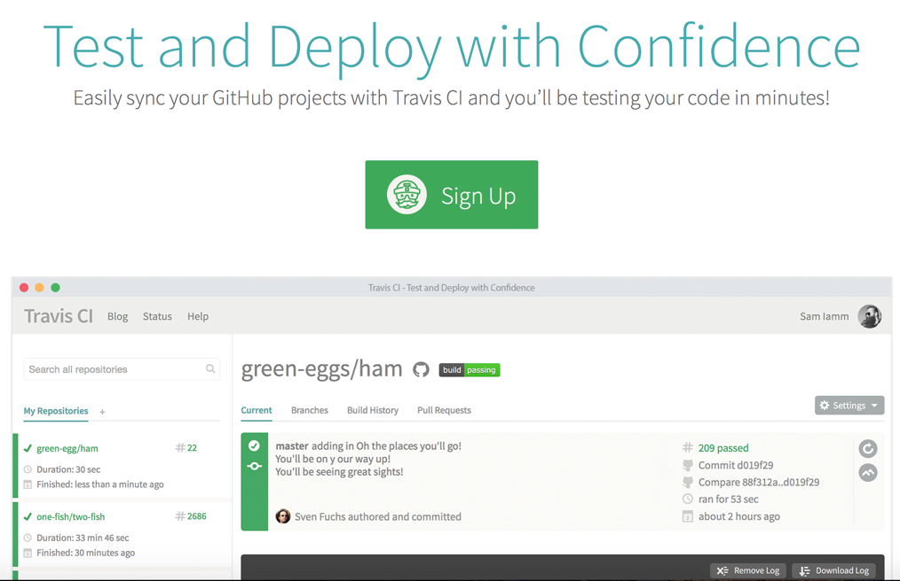
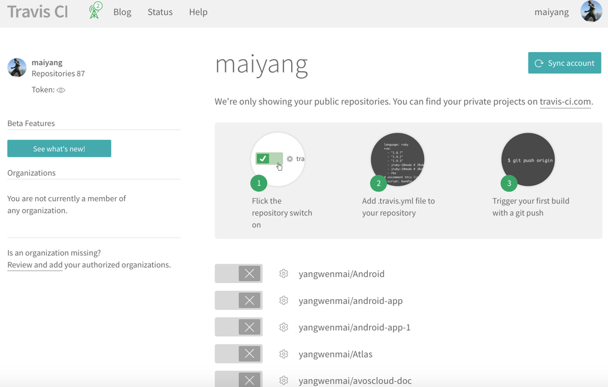
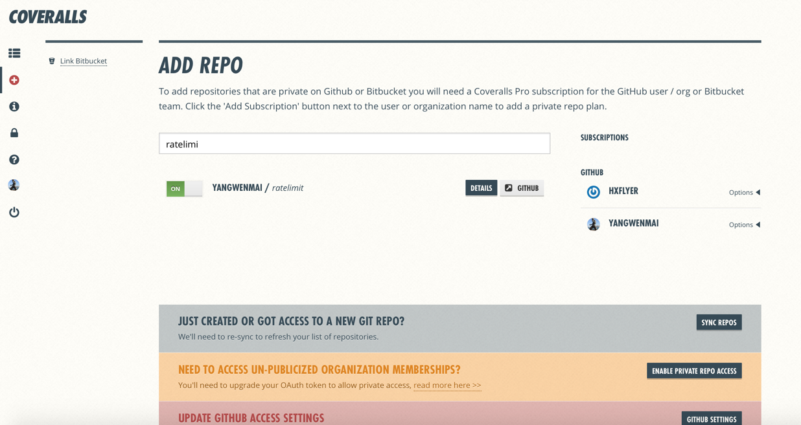
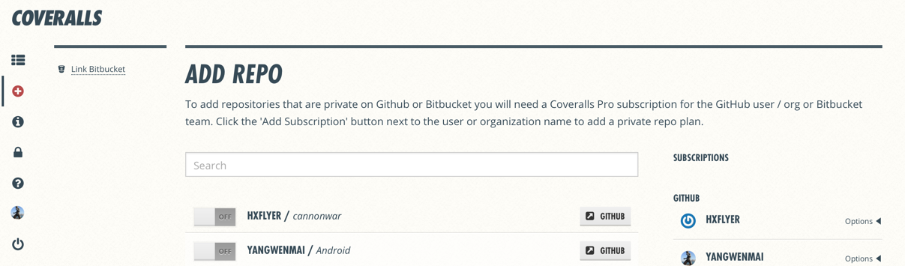
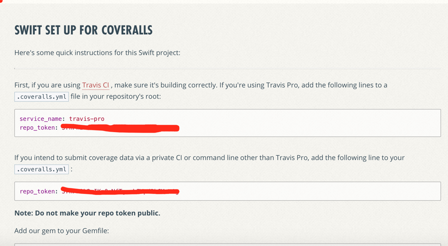
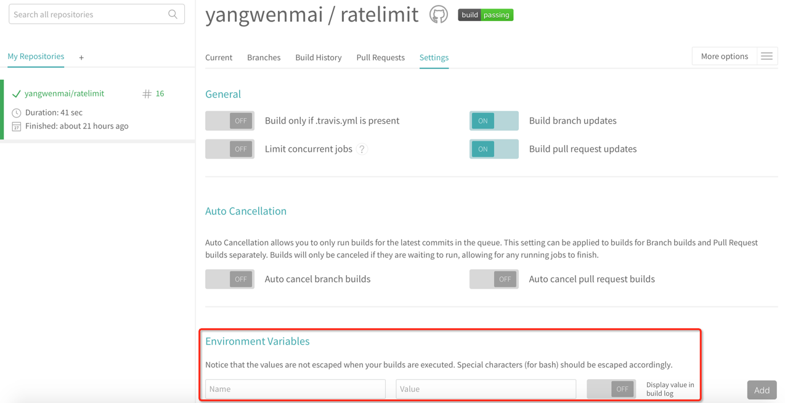
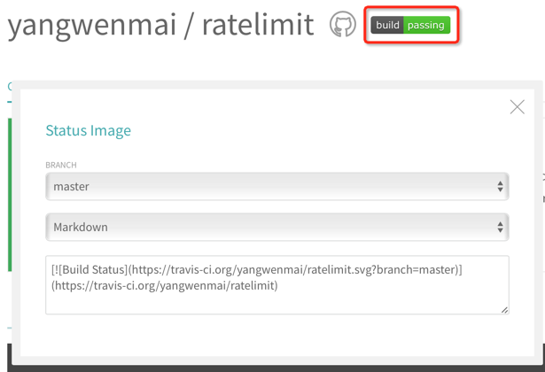
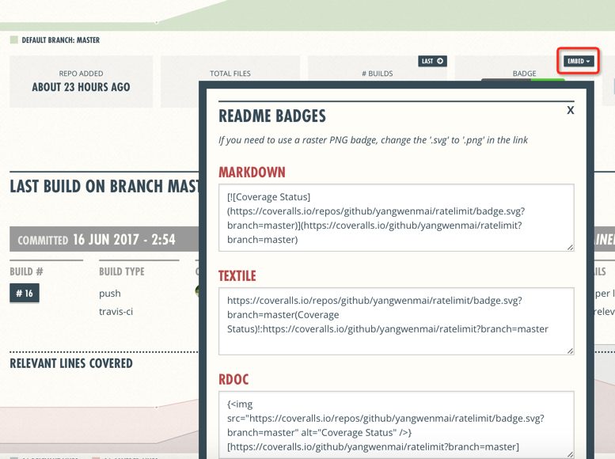

# 如何在 README 里面添加徽章（Travis-CI & GoReportCard & Coveralls ...） [](https://goreportcard.com/report/github.com/yangwenmai/how-to-add-badge-in-readme)

作为一个 Golang 开发者，应该都知道 TiDB 吧，如果你不知道，那我只能说赶紧去了解了解吧。

在 TiDB README 上大家应该都能看到这些徽章：

[](https://travis-ci.org/pingcap/tidb)
[](https://goreportcard.com/report/github.com/pingcap/tidb)
[](https://coveralls.io/github/pingcap/tidb?branch=master)

你是不是也很想在你的 Github 项目上也加上呢？你会觉得难吗？

我今天就是来告诉大家怎么做的，希望能帮助到你。

徽章在 Github 上配置起来非常简单，但是有可能你是基于 Gitlab 的私有仓库，那这篇文章可能会对你有帮助。

废话不多说，我先来简单介绍一下这3个徽章是什么。

## Travis-CI 是什么？

[Travis-CI](https://travis-ci.org) 是国外的开源持续集成构建项目，支持 Github 项目，通过 yml 配置来驱动执行相对应的持续集成脚本。对于 Github 的项目支持起来非常简单，开通 Travis 后只需要你在自己的项目根目录下增加`.travis.yml`就好了。

## GoReportCard 是什么？

[GoReportCard](https://goreportcard.com/) 是一个可视化展示 Go 语言项目的检测报告服务。

## Coveralls 是什么？

[Coveralls](https://coveralls.io) 是一个自动化测试覆盖率的服务，它能提供代码覆盖率并且给以友好的展现。

----

# 添加Build Status

这里用到的就是Travis-CI。

### 开通Travis

打开 travis 官网:https://travis-ci.org/



使用github账号授权登录。

添加项目，这里使用我的 Golang 示例项目。



整个 ci 的过程有以下几步:
1. 在 travis-ci 你的 profile 页面，勾选上你要持续集成的项目
2. 在你的 Github 项目根目录下添加`.travis.yml`，Travis-CI会按照`.travis.yml`里的内容进行构建
3. 提交`.travis.yml`到 Github，自动触发持续集成，
4. 你可以到[travis-ci-status](https://travis-ci.org/yangwenmai/how-to-add-badge-in-readme) 查看结果

下面给一个我的`.travis.yml`例子:
```yml
language: go # 声明构建语言环境
sudo: false # 开启基于容器的Travis CI任务，让编译效率更高。

notifications: # 每次构建的时候是否通知，如果不想收到通知，那就设置false吧(email: false)
  email:
    recipients:
      - yournam@xxx.com
  on_success: change
  on_failure: always

go:
  - 1.8.3

install:#依赖安装
  - go get github.com/go-playground/overalls #overalls能够支持到各级子目录
  - go get github.com/mattn/goveralls #goveralls是coveralls对golang的测试覆盖率支持命令
  - go get github.com/smartystreets/goconvey#很好用的测试工具
  - mkdir -p $GOPATH/src/github.com/yangwenmai
  - cd $GOPATH/src/github.com/yangwenmai/how-to-add-badge-in-readme

script:# 集成脚本
    - overalls -project=github.com/yangwenmai/how-to-add-badge-in-readme -covermode=count -ignore='.git,_vendor'
    - goveralls -coverprofile=overalls.coverprofile -service=travis-ci -repotoken $COVERALLS_TOKEN
    - go test ./...

env:#env环境变量设置，travis提供的repo_token安全方式
  global:
    secure: "xxxx"
```

更多配置，可以参考:https://docs.travis-ci.com/user/customizing-the-build/

# 添加Go Report Card

1. 打开 https://goreportcard.com/
2. 在输入框内输入你要检测的 Github 项目地址
3. 点击 Generate Report
4. 然后会跳到 https://goreportcard.com/report/github.com/golang/go
5. 你可以查看检测报告,与此同时，你可以点击右上角的 go report| C
6. 复制弹框中的 Markdown 格式
7. 将第 6 步中的内容粘贴到你的项目 README 中，push 到 Github，刷新即可看到你 Go 项目的检测报告了。

# 添加Coverage Status

### 开通Coveralls


#### 授权登录

在[Coveralls](https://coveralls.io)官方网站使用github账号登录授权。

#### 添加项目




#### 查看repo_token



repo_token涉及安全不应该提交到`.travis.yml`，coveralls提供了非对称加密repo_token的方法。

对于密码等敏感信息，Travis CI提供了2种解决方案：

- 对密码等敏感信息进行加密，然后再构建环境时解密。
- 在Travis CI控制台设置环境变量，然后使用System.getenv()获取值。



对于文件加密，Travis CI提供了一个基于ruby的CLI命令行工具，可以直接使用gem安装：

`gem install travis`

注意:gem安装依赖于ruby以及ruby版本。
还有众所周知的原因，你最好切换一个gem源。

`gem sources -l #查看gem源`

对你的token加密:

`travis encrypt COVERALLS_TOKEN=your_token`

将得到的值填写到`.travis.yml`的 secure 中即可。

## 最后:如何在自己的项目中显示Status Image?

操作起来很简单，只需要在你的 README.md 中增加 badge 链接即可。

travis页面复制图标标签


coveralls复制图标标签


然后将代码全部提交到 Github，你就可以看到 build status 和 coveralls 了。

# 参考资料

1. https://github.com/pingcap/tidb
2. https://github.com/nukc/how-to-use-travis-ci
3. https://www.jerrylou.me/工具/howto-github-travisci-coveralls-20170120.html

# 赞助我


